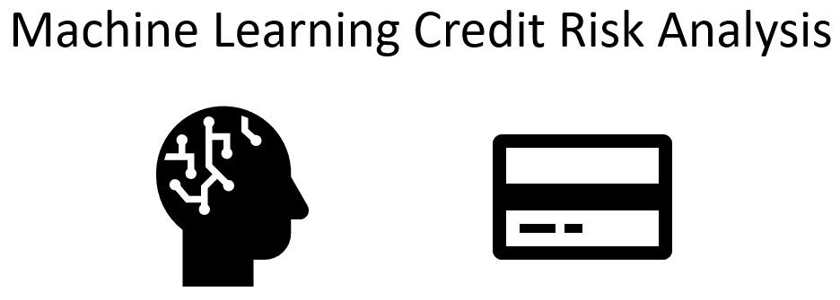

# credit-risk-classification
Module # 20 - Credit Risk Classification

## Overview of the Analysis

In this section, describe the analysis you completed for the machine learning models used in this Challenge. This might include:

* Explain the purpose of the analysis.

The purspose of the loan analysis is to determine the credit risk of the loan applicants. The analysis will use machine learning models to predict the credit risk of the loan applicants. The analysis will use the following machine learning models:

* Explain what financial information the data was on, and what you needed to predict.

The data used for the analysis is the loan application data. The data includes the following information: loan size, interest rate, borrower income, debt-to-income ratio, number of accounts, derogatory marks, total debt, and loan status. All of this data is used to predict the credit risk of the loan applicants based on the target data of the their loan status.

* Provide basic information about the variables you were trying to predict.

The target data is the loan status which is either low risk/Healthy Loan `0` or a High Risk loan `1`. 

* Describe the stages of the machine learning process you went through as part of this analysis.

Once the data is pulled into a dataframe the next step is to perform some basic analysis to check for missing data points or outliers that just don’t fit the overall dataset. However, in this case it was provided to us in a relatively clean state. From there the data is split into a features dataset (borrower information) and the target dataset (loan status). Then the data is split using the 'train_test_split' function from sklearn tool kit. 

Once the training and testing data is established we can now use the training data (X_train & y_train) to teach our model what combination of ‘features’ results in a certain type of ‘target’ outcome. After training the machine learning models with a subset of the data, the model is given test data to predict the credit risk of the loan applicants. The machine learning models are then evaluated based on their accuracy, precision, and recall scores. 

* Briefly touch on any methods you used (e.g., `LogisticRegression`, or any resampling method).

This credit risk analysis used a Logistic Regression model which, at a basic level, is a statistical analysis used to predict a binary outcome of either 0 or 1 for each data point. First, the model is trained on a subset of data. By default, the ‘train_test_split’ function uses 75% of the available dataset for ‘training’ on what model features for a given borrower result in that borrower having a loan. Then the model uses the remaining 25% of the dataset for testing by only looking at the features (X) and making a prediction of the loan status (Y). 

Finally, the performance of the model is reviewed using three separate functions that exam the same datasets of ‘y_test’ and ‘predictions’. First, is the ‘balanced_accuracy_score’ function which outputs a single statistical value between 0 and 1 that is read as a percentage. In this case the model was 95% accurate when comparing the ‘predictions’ and the ‘Y_test’ datasets. Next is the ‘confustion_matrix’ that generates a 2x2 matrix comparing actual results versus predicted results. The top-left and bottom-right values in this matrix should always be the largest numbers if the model performed well. The top-left confirms that the “No” values were correctly predicted as “No” and the bottom-right confirms the “Yes” values were correctly predicted as “Yes”. If the model performed well the opposite corners should be relatively very low numbers. The last function to review the performance of the model is the ‘classification_report’ that outputs a table examining the precision, recall, and f1-score. It also generates values for the overall accuracy, macro average, and weight average.

## Results

Using bulleted lists, describe the balanced accuracy scores and the precision and recall scores of all machine learning models.

* Machine Learning Model 1:
  * Description of Model 1 Accuracy, Precision, and Recall scores.

    The logistic regression model predicts the overll accuracy of Healthy Loans `0` and High Risk Loans `1` at 99%. Individually the precicion is 100% and 85% for Healthy Loans `0` and High Risk Loans `1` respectively. The recall is 99% and 91% for Healthy Loans `0` and High Risk Loans `1` respectively. The F1 score is 100% and 88% for Healthy Loans `0` and High Risk Loans `1` respectively. The precision, recall, and F1 score for Healthy Loans `0` is higher than High Risk Loans `1` which means the model is better at predicting Healthy Loans `0` than High Risk Loans `1`. The model is better at predicting Healthy Loans `0` than High Risk Loans `1` because the testing data is imbalanced with 18,765 Healthy Loans `0` compared to only 619 High Risk Loans `1`.

* Machine Learning Model 2:
  * Description of Model 2 Accuracy, Precision, and Recall scores.

    The oversampled data model predicts the Healthy Loans `0` and High Risk Loans `1` with 99% accuracy, which is the same as the original model. The precision for the High Risk Loans `1` is 84%, which is lower than the original model. The recall for the High Risk Loans `1` is 99%, which is higher than the original mode at 91%. The F1 score for the High Risk Loans `1` is 91%, which is higher than the original model at 88%

## Summary

Summarize the results of the machine learning models, and include a recommendation on the model to use, if any. For example:
* Which one seems to perform best? How do you know it performs best?

The original model and the oversampled data model both predict the Healthy Loans `0` and High Risk Loans `1` with 99% accuracy. The oversampled data model has a lower precision for the High Risk Loans `1` at 84% compared to the original model at 85%. The oversampled data model has a higher recall for the High Risk Loans `1` at 99% compared to the original model at 91%. The oversampled data model has a higher F1 score for the High Risk Loans `1` at 91% compared to the original model at 88%. The oversampled data model is better at predicting High Risk Loans `1` than the original model because the oversampled data model has a higher recall and F1 score for High Risk Loans `1`.

* Does performance depend on the problem we are trying to solve? (For example, is it more important to predict the `1`'s, or predict the `0`'s? )

Overall, the oversampled data model is able to maintain the same accuracy as the original model for predicting Healthy Loans `0` and slighly improve the accuracy for predicting High Risk Loans `1`. From a business perspective, the oversampled data model is better at predicting High Risk Loans `1` which is the most important metric for the credit risk analysis. Therefore, the oversampled data model is the best model to use for predicting credit risk.

